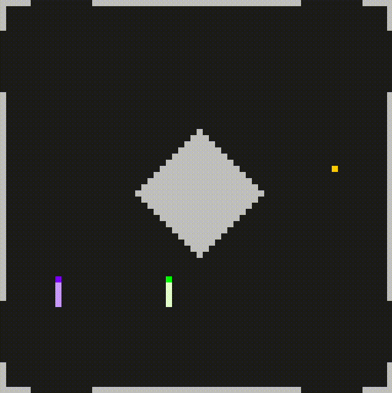
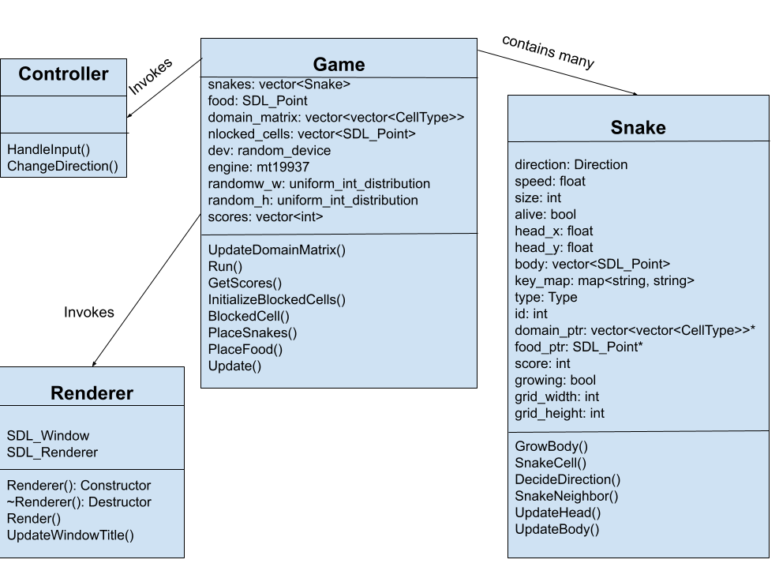

# CPPND: Capstone Snake Game Example

This is the Capstone project in the [Udacity C++ Nanodegree Program](https://www.udacity.com/course/c-plus-plus-nanodegree--nd213). The code for this repo was inspired by [this](https://codereview.stackexchange.com/questions/212296/snake-game-in-c-with-sdl) excellent StackOverflow post and set of responses. The starter code for this repo was provided [here](https://github.com/udacity/CppND-Capstone-Snake-Game.git).
This project, extends the functionality of the basic snake game. Some of the newly added features are based on ideas from  [gnome-nibbles](https://wiki.gnome.org/Apps/Nibbles). A sample gif animation of the extended snake game is shown below:



## Dependencies for Running Locally
* cmake >= 3.7
  * All OSes: [click here for installation instructions](https://cmake.org/install/)
* make >= 4.1 (Linux, Mac), 3.81 (Windows)
  * Linux: make is installed by default on most Linux distros
  * Mac: [install Xcode command line tools to get make](https://developer.apple.com/xcode/features/)
  * Windows: [Click here for installation instructions](http://gnuwin32.sourceforge.net/packages/make.htm)
* SDL2 >= 2.0
  * All installation instructions can be found [here](https://wiki.libsdl.org/Installation)
  * Note that for Linux, an `apt` or `apt-get` installation is preferred to building from source.
* gcc/g++ >= 5.4
  * Linux: gcc / g++ is installed by default on most Linux distros
  * Mac: same deal as make - [install Xcode command line tools](https://developer.apple.com/xcode/features/)
  * Windows: recommend using [MinGW](http://www.mingw.org/)

## Basic Build Instructions

1. Clone this repo.
2. Make a build directory in the top level directory: `mkdir build && cd build`
3. Compile: `cmake .. && make`
4. Run it: `./SnakeGame`
5. Optionally, layout and config files can be used to specify different
   layouts and game configurations using the `-l` and `-c` command line options respectively, as shown below:

  `./SnakeGame -l ../layouts/horizontal_divider.txt -c ../config.txt`


   * Sample layouts can be found in the layouts/ folder.
     The layout file can be specified by using the `-l` command line option, as
     shown below:

     `./SnakeGame -l ../layouts/horizontal_divider.txt`

     The first line in the layout file has two entries corresponding to the
     `grid width`  and `grid_height` respectively. The remaining lines specify the
     entries in a matrix of dimensions (`grid_width x grid_height`). The
     blocked/wall cells of the grid are indicated by non-zero values while
     the open cells are denoted by a value of 0.

   * The configuration file can be specified using the `-c` command line option, as shown below:

     `./SnakeGame -c ../config.txt`

     A sample configuration file is contained in the top level directory of the
     repository and is named `config.txt`. The default contents of the
     configuration file are shown below:

      ```
      4
      4
      up down left right
      w s a f
      k j h l
      g b v n
      ```

      The first line specifies the total number players (or snakes) in the game (4
      for the a configuration shown above). The second line specifies the number
      of human players in the game (4 for the configuration file shown above).
      Each line thereafter indicates the `up`, `down`, `left`, `right` keys for
      each human player. Not all keys are allowed but most printable keys are
      permitted. Since the up, down, left and right arrow keys are not printable
      keys, they can be specified by using the strings "up", "down", "left",
      "right" strings as shown in the sample configuration file above. If no
      configuration file is specified, then the default values correspond to the configuration file shown below (i.e., 1 human and 1 machine player):

        ```
        2
        1
        up down left right
        ```

## Project Description

This project extends the baseline snake game that was provided. In the baseline
snake game, the user controls a snake. The snake moves around the domain trying
to eat food which is indicate by a yellow block. When a snake consumes the food,
new food pops up at a random location in the grid. The length of the snake and its speed increases when it consumes food. The following extensions have been made:

* The baseline snake game has only one layout, where the entire domain is
  empty. The extended snake game allows arbitrary layouts that can be specified
  using a layout file. A layout file specifies blocked cells (walls) in the
  game domain. Sample domains are provided in the layouts/ folder.

* The baseline snake game involves only one player. The extended snake game
  allows multiple players.

* The baseline snake game involves only human players. The extended snake game
  allows both human and machine players. A maximum of four players (machine and
  human) are allowed. The machine players are programmed to seek the food
  automatically and have been found to be better than most human players.

## File and Class Structure

### File Structure
The source code can be found in the ./src folder. The layout files can be found
in the ./layouts folder. The images can be found in the ./images folder.


### Class Structure

The key classes in the code are listed below:

* **Snake:** This class data and methods that model the properties and behavior of
  a single snake. The agent behind a snake can be a human or a computer.

* **Game:** This class brings together all the elements of the game, such as the
  snakes, layout, food, etc. There is only one instance of this class.

* **Controller:** The controller handles input from the player(s) and controls the
  snake(s) movement accordingly.

* **Renderer:** This class is responsible for displaying the different components
  of the game at each frame of the game. Besides the snakes, it is responsible
  for displaying the walls (blocked cells), food and scores.

  The structure of each of the above classes and their relationships are shown below:



## Addressing Rubric Points

### README

* **A README with instructions is included with the project**
  * README has been updated to include all the relevant details of the project

* **The README indicates which project is chosen.**
  * The snake game that was provided has been extended to include many more features.

* **The README includes information about each rubric point addressed.**
  * The sections below describe how each rubric point has been addressed.

### Compiling and Testing

* **The submission must compile and run.**
  * The submission compiles and runs as expected. The instructions for compiling and running have been provided in an earlier section.

### Loops, Functions, I/O

* **The project demonstrates an understanding of C++ functions and control structures.**
  * Different C++ control structures such as if-else, for loops, switch, etc. are used

* **The project reads data from a file and process the data, or the program writes data to a file.**
  * The program reads a text file and uses it to define the layout for the game

* **The project accepts user input and processes the input.**
  * The program accepts the user inputs for controlling the snakes. The user inputs can be customized for multiple players.

### Object Oriented Programming

* **The project uses Object Oriented Programming techniques.**
  * The project uses multiple classses (*Controller*, *Game*, *Renderer*, *Snake*)

* **Classes use appropriate access specifiers for class members.**
  * Access specifiers have been used in all classes to control access to class members for all classes

* **Class constructors utilize member initialization lists.**
  * Member initialization lists have been used in all the constructors of the *Game* class.

### Memory Management

* **The project makes use of references in function declarations.**
  * References are used in the following functions - *Snake::UpdateBody, Renderer::Render, Game::Run, Controller::HandleInput, Controller::ChangeDirection*.

* **The project follows the Rule of 5.**
  * The "Rule of 5" is implemented for the *Game* and *Snake* classes.

* **The project uses move semantics to move data, instead of copying it, where possible.**
  * Move semantics is used where appropriate in the *Game* and *Snake* classes to move arrays instead of copying them.

## Future Work

This project extends the baseline snake game by adding several new features. There is scope for improvement and some ideas for further extending this project are listed below:

* The game configuration could be specified using the GUI interface instead of a configuration file.

* More layouts can be added.

* The game can be played at successive levels with increasing difficulty, with
  each level automatically loaded once the preceing level is completed.

* The machine's ability to navigate to the goal (food) is can be improved with
  a more powerful algorithm such as the A-star algorithm.
